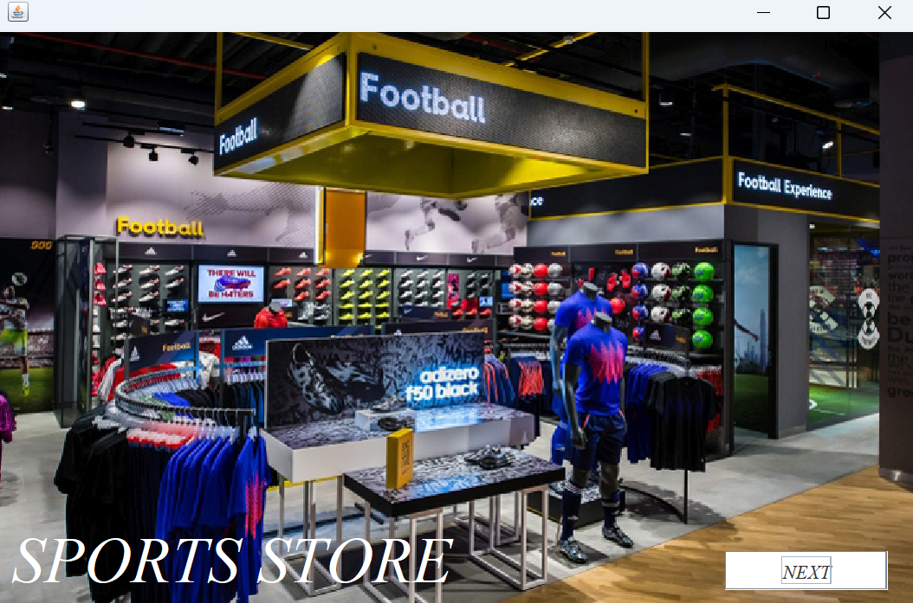
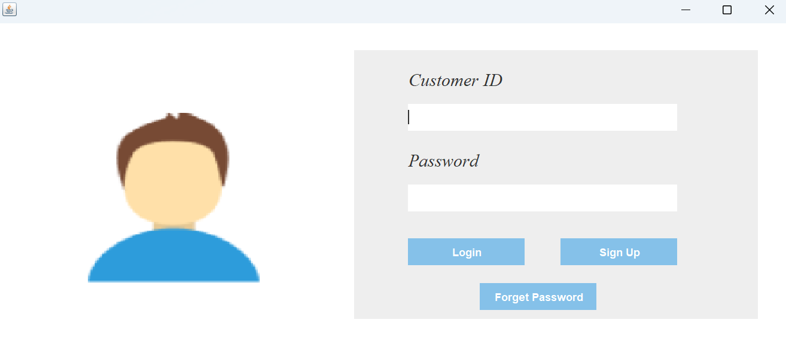
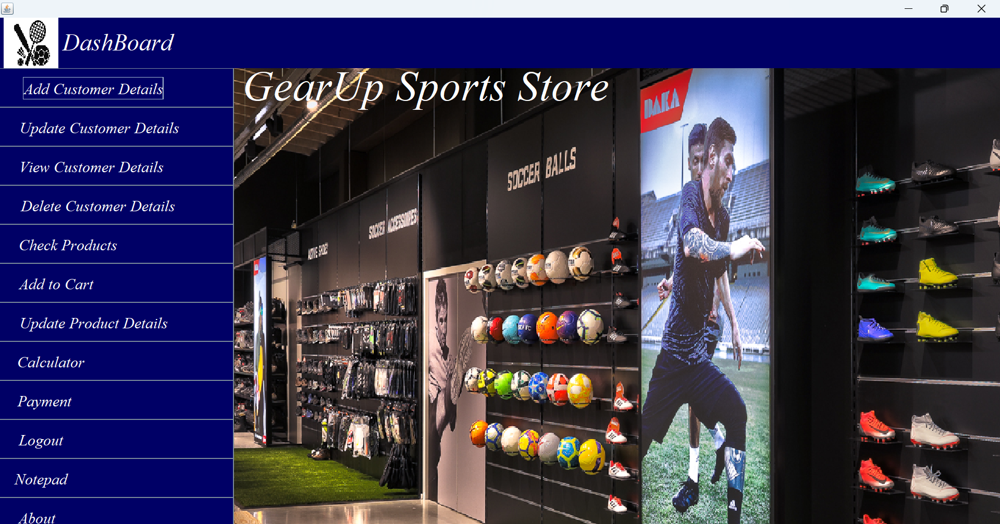
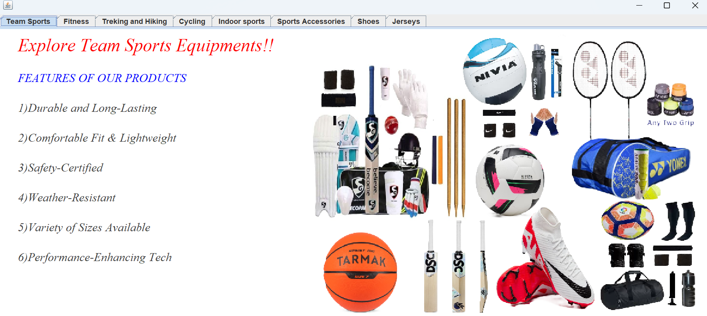
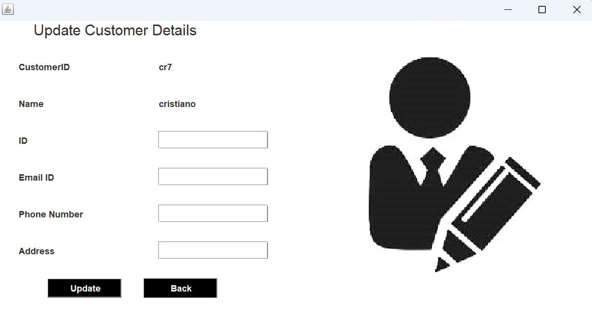
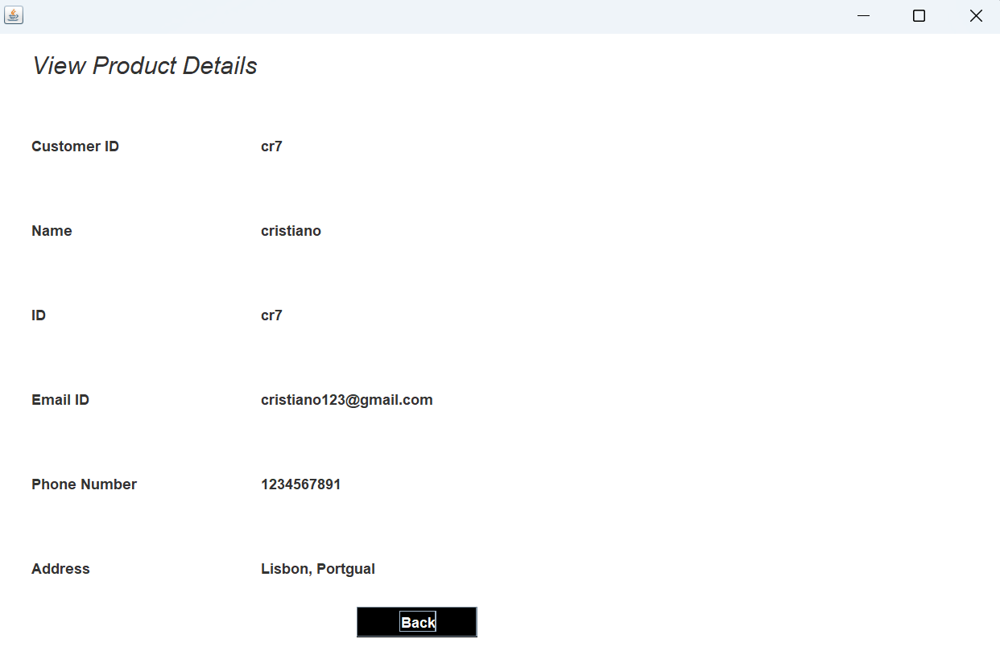
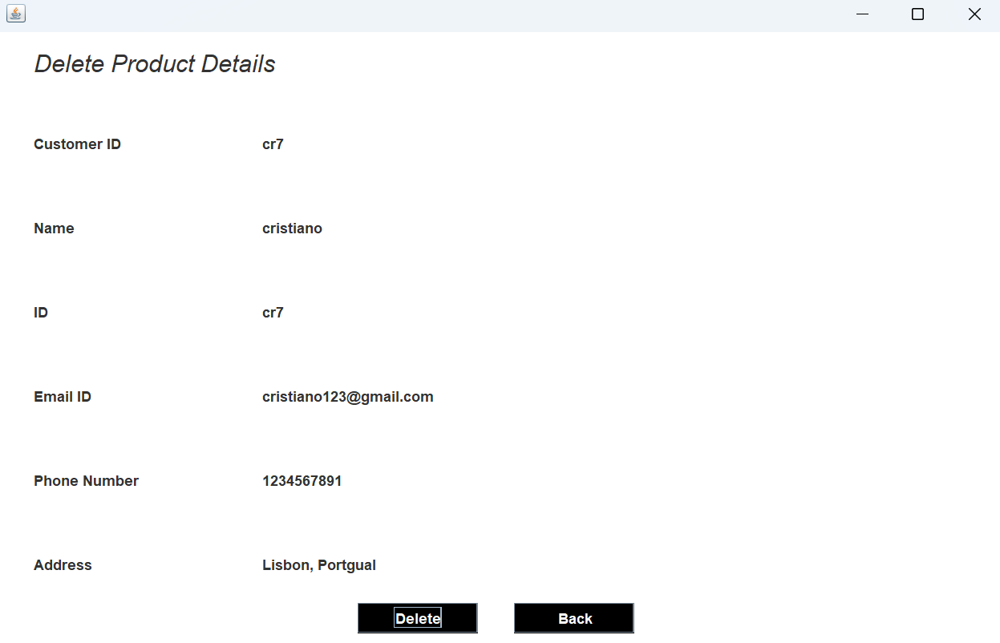

<p align="center">
  <h1 align="center">🏏 GearUp Sports Store — Management System</h1>
  <p align="center">
    <strong>A Java Swing desktop application for managing sports retail store operations</strong>
  </p>
  <p align="center">
    <em>Inventory browsing · Customer management · Shopping cart · Payment processing · Built-in utilities</em>
  </p>
</p>

<p align="center">
  
  
  
  
  
</p>

---

## 📖 Table of Contents

- [About](#-about)
- [Key Features](#-key-features)
- [Product Catalog](#-product-catalog)
- [Tech Stack](#-tech-stack)
- [Project Structure](#-project-structure)
- [Database Setup](#-database-setup)
- [Getting Started](#-getting-started)
- [Application Flow](#-application-flow)
- [Screenshots](#-screenshots)
- [Limitations](#-limitations)
- [Future Enhancements](#-future-enhancements)
- [Team](#-team)
- [Disclaimer](#%EF%B8%8F-disclaimer)

---

## 💡 About

**GearUp Sports Store** is a comprehensive desktop-based retail management system built using **Java Swing** and **MySQL**. It provides an end-to-end solution for sports store operations — from customer registration and authentication to product browsing, cart management, and payment processing.

The application features a rich graphical interface with product images, tabbed product catalogs, dynamic dropdown-based cart selection, and integrated utilities like a calculator and notepad for daily store operations.

---

## ✨ Key Features

### 🔐 Authentication & Security
- **Customer Login** — Secure login with Customer ID and Password
- **Sign Up** — New customer registration with security question for account recovery
- **Forgot Password** — Password recovery using security question verification
- **Splash Screen & Loading Animation** — Professional app launch experience

### 👤 Customer Management (Full CRUD)
- **Add Customer** — Register new customer details into the system
- **View Customer** — Browse and search existing customer records
- **Update Customer** — Modify customer information
- **Delete Customer** — Remove customer records from the database

### 🛒 Shopping Cart System
- **Category-based product selection** — 8 main product categories with dynamic sub-category dropdowns
- **Brand selection** — Choose from 10 premium sports brands (Nike, Adidas, Puma, Decathlon, etc.)
- **Quantity input** — Specify item quantities with automatic price calculation
- **Warranty selection** — 1, 2, or 3-year warranty options
- **Total price computation** — Real-time price × quantity calculation
- **Remove products** — Remove selected items from the cart

### 📦 Product Catalog (Tabbed View)
- **8 product categories** displayed in a professional tabbed interface
- Each tab includes product **feature highlights** and **product images**
- Visual showcase of available inventory with detailed specifications

### 💳 Payment Processing
- **Payment gateway** with Pay and Back options
- **Paytm integration screen** — Simulated payment flow

### 🔧 Built-in Utilities
- **Calculator** — Quick-launch Windows calculator for price computations
- **Notepad** — Quick-launch Windows notepad for notes and memos
- **About Section** — Store information and advantages overview

### 📊 Product & Inventory Management
- **Check Products** — Browse the full product catalog with images
- **Update Product Details** — Modify product information in the database
- **View Products** — Display current product listings with details

---

## 🏪 Product Catalog

GearUp offers **60+ products** across **8 categories** from **10 global brands**:

### Categories & Products

| Category | Products Available |
|----------|-------------------|
| 🏏 **Team Sports** | Cricket Kit, Football Kit, Badminton Kit, Volleyball Kit, Basketball Kit, Hockey Kit |
| 💪 **Fitness** | Gym Equipment Kit, Adjustable Dumbbells, Treadmill, Benchpress Machine, Leg Equipment, Exercise Bike, Gym Bags |
| 🏔️ **Trekking & Hiking** | Trekking Jackets, Trekking Shoes, Tents, Backpack, Waist Bags, Compass, Binoculars, Gloves |
| 🚴 **Cycling** | Cycles, Foldable Cycles, Helmets, Cycling Clothing, Air Pump, Locks, Cycling Accessories |
| 🏓 **Indoor Sports** | Table Tennis Kit, TT Table, Badminton, Squash Rackets, Carrom, Chess, Boxing Kit, Dart Board, Archery, Padel |
| 🎒 **Sports Accessories** | Water Bottles, Sunglasses, Gloves, Resistance Bands, First-Aid Kit, Socks, Micro-Fiber Towels, Massagers, Proteins & Bars |
| 👟 **Shoes** | Running, Casual, Cleats, Football Studs, Football Trainers, Cricket, Badminton, Basketball, Sneakers |
| 🎽 **Jerseys** | Team Jerseys, Training Jerseys, Custom Jerseys |

### Supported Brands

| | | | | |
|---|---|---|---|---|
| Nike | Adidas | Puma | Decathlon | New Balance |
| Reebok | The North Face | Asics | Patagonia | Salomon |

---

## 🛠 Tech Stack

| Technology | Purpose |
|-----------|---------|
| **Java 17+** | Core programming language |
| **Java Swing** | Desktop GUI framework (JFrame, JPanel, JButton, JTabbedPane, Choice) |
| **AWT** | Graphics, event handling, and layout management |
| **MySQL** | Relational database for persistent storage |
| **JDBC** | Database connectivity (MySQL Connector/J) |
| **NetBeans IDE** | Project build system and development environment |

---

## 📁 Project Structure

```
Sports_store_management_system/
├── src/
│   ├── Images/                              # Product & UI images
│   └── sports/store/management/system/      # Java source files
│       ├── SportsStoreManagementSystem.java  # Main entry point
│       ├── Splash.java                      # Splash screen
│       ├── Loading.java                     # Loading animation
│       ├── Login.java                       # Customer login
│       ├── SignUp.java                      # New customer registration
│       ├── ForgetPassword.java              # Password recovery
│       ├── Dashboard.java                   # Main dashboard (navigation hub)
│       ├── Addcustomer.java                 # Add customer details
│       ├── ViewCustomer.java                # View customer records
│       ├── UpdateCustomer.java              # Update customer info
│       ├── DeleteDetails.java               # Delete customer records
│       ├── CheckProducts.java               # Product catalog (tabbed view)
│       ├── ViewProducts.java                # View product listings
│       ├── UpdateProductDetails.java        # Update product info
│       ├── AddtoCart.java                   # Shopping cart system
│       ├── Payment.java                     # Payment gateway
│       ├── Paytm.java                       # Paytm payment screen
│       ├── Conn.java                        # Database connection (JDBC)
│       └── About.java                       # About the store
├── build.xml                                # Ant build configuration
├── manifest.mf                              # JAR manifest
├── nbproject/                               # NetBeans project config
├── build/                                   # Compiled classes
├── dist/                                    # Distributable JAR
└── README.md
```

---

## 🗄 Database Setup

### 1. Create the Database

```sql
CREATE DATABASE gearupsportsstore;
USE gearupsportsstore;
```

### 2. Create Required Tables

```sql
-- Customer authentication table
CREATE TABLE customer (
    customerID VARCHAR(50) PRIMARY KEY,
    name VARCHAR(100),
    password VARCHAR(100),
    security_question VARCHAR(200),
    answer VARCHAR(100)
);

-- Customer details table
CREATE TABLE customer1 (
    CustomerID VARCHAR(50) PRIMARY KEY,
    Name VARCHAR(100),
    Phone VARCHAR(20),
    Email VARCHAR(100),
    Address VARCHAR(255)
);

-- Products added to cart
CREATE TABLE products1234567 (
    CustomerID VARCHAR(50),
    Product VARCHAR(100),
    Brand VARCHAR(50),
    Quantity VARCHAR(10),
    Warranty VARCHAR(20),
    TotalPrice VARCHAR(50),
    PurchaseDate TIMESTAMP DEFAULT CURRENT_TIMESTAMP
);

-- Sub-product selections
CREATE TABLE subproduct12345 (
    CustomerID VARCHAR(50),
    TeamSports VARCHAR(100),
    Fitness VARCHAR(100),
    Trekking VARCHAR(100),
    Cycling VARCHAR(100),
    IndoorSports VARCHAR(100),
    Accessories VARCHAR(100),
    Shoes VARCHAR(100),
    Jerseys VARCHAR(100)
);
```

### 3. Configure Database Connection

Update `Conn.java` with your MySQL credentials:

```java
c = DriverManager.getConnection("jdbc:mysql:///gearupsportsstore", "your_username", "your_password");
```

---

## 🚀 Getting Started

### Prerequisites

- **Java JDK** ≥ 17
- **MySQL Server** ≥ 8.0
- **MySQL Connector/J** (JDBC driver JAR)
- **NetBeans IDE** (recommended) or any Java IDE

### Steps

1. **Clone the Repository**
   ```bash
   git clone https://github.com/omi3107/Sports-Store-Management-System-.git
   cd Sports-Store-Management-System-
   ```

2. **Set up MySQL Database**
   - Run the SQL commands from the [Database Setup](#-database-setup) section above

3. **Add MySQL Connector JAR**
   - Download [MySQL Connector/J](https://dev.mysql.com/downloads/connector/j/)
   - Add it to the project's classpath (in NetBeans: Project Properties → Libraries → Add JAR)

4. **Update Database Credentials**
   - Edit `src/sports/store/management/system/Conn.java`
   - Replace the username and password with your MySQL credentials

5. **Build & Run**
   - Open the project in NetBeans
   - Click **Run** ▶️ or press `F6`
   - The Splash screen will launch, followed by the Login page

---

## 🔄 Application Flow

```
┌─────────────┐     ┌─────────────┐     ┌─────────────┐
│   Splash     │────▶│   Loading    │────▶│    Login     │
│   Screen     │     │  Animation   │     │    Page      │
└─────────────┘     └─────────────┘     └──────┬──────┘
                                               │
                              ┌────────────────┼────────────────┐
                              │                │                │
                       ┌──────▼──────┐  ┌──────▼──────┐  ┌─────▼──────┐
                       │   Sign Up   │  │  Dashboard   │  │  Forgot    │
                       │             │  │  (Main Hub)  │  │  Password  │
                       └─────────────┘  └──────┬──────┘  └────────────┘
                                               │
            ┌──────────┬──────────┬────────────┼────────────┬──────────┐
            │          │          │            │            │          │
     ┌──────▼───┐ ┌────▼────┐ ┌──▼──────┐ ┌──▼──────┐ ┌──▼──────┐ ┌─▼────────┐
     │ Customer │ │ Check   │ │ Add to  │ │ Payment │ │ Update  │ │ Utils    │
     │ CRUD     │ │Products │ │  Cart   │ │         │ │Products │ │(Calc,    │
     │          │ │(Catalog)│ │         │ │         │ │         │ │Notepad,  │
     │ • Add    │ │         │ │• Select │ │• Pay    │ │         │ │About)    │
     │ • View   │ │ 8 Tabs  │ │• Brand  │ │• Paytm  │ │         │ │          │
     │ • Update │ │ Images  │ │• Qty    │ │         │ │         │ │          │
     │ • Delete │ │ Features│ │• Price  │ │         │ │         │ │          │
     └──────────┘ └─────────┘ └─────────┘ └─────────┘ └─────────┘ └──────────┘
```

---

## 📸 Screenshots

<table>
  <tr>
    <td width="50%" align="center">
      
      <br />
      <b>Splash Screen</b>
    </td>
    <td width="50%" align="center">
      
      <br />
      <b>Login Page</b>
    </td>
  </tr>
  <tr>
    <td width="50%" align="center">
      
      <br />
      <b>Sign Up</b>
    </td>
    <td width="50%" align="center">
      
      <br />
      <b>Dashboard</b>
    </td>
  </tr>
  <tr>
    <td colspan="2" align="center">
      
      <br />
      <b>Product Catalog (Tabbed View)</b>
    </td>
  </tr>
</table>

<table>
  <tr>
    <td width="50%" align="center">
      
      <br />
      <b>Add Customer Details</b>
    </td>
    <td width="50%" align="center">
      
      <br />
      <b>Update Customer Details</b>
    </td>
  </tr>
  <tr>
    <td width="50%" align="center">
      
      <br />
      <b>View Customer Details</b>
    </td>
    <td width="50%" align="center">
      
      <br />
      <b>Delete Customer Details</b>
    </td>
  </tr>
  <tr>
    <td colspan="2" align="center">
      
      <br />
      <b>Payment</b>
    </td>
  </tr>
</table>

---

## � Future Enhancements

| Enhancement | Description |
|-------------|-------------|
| **Prepared Statements** | Replace string-concatenated SQL queries with `PreparedStatement` to prevent SQL injection attacks |
| **Password Hashing** | Implement BCrypt or SHA-256 hashing for secure password storage |
| **Database-Driven Pricing** | Move product prices and catalog data to MySQL tables instead of hardcoding in Java |
| **Order History** | Add a dedicated screen to view past purchases, order dates, and total spending per customer |
| **Invoice Generation** | Auto-generate printable PDF invoices after successful payment |
| **Search & Filter** | Add product search bar and category/brand/price-range filters in the product catalog |
| **Stock Management** | Track inventory quantities, show "Out of Stock" labels, and alert on low stock levels |
| **Admin Panel** | Separate admin login with privileges for managing products, viewing all orders, and generating sales reports |
| **Export to Excel** | Allow exporting customer data and sales reports to `.csv` or `.xlsx` files |
| **Cross-Platform Support** | Replace Windows-specific utility calls with platform-independent Java alternatives |

---

## �👥 Team

**omi3107** — Developer

---

## ⚠️ Disclaimer

This project was developed as part of a **college laboratory assignment** with specified academic requirements. It is intended for **educational and demonstration purposes only** and is not designed for production or commercial use. 

---

<p align="center">
  <sub>Built with ❤️ using Java Swing & MySQL</sub>
</p>
